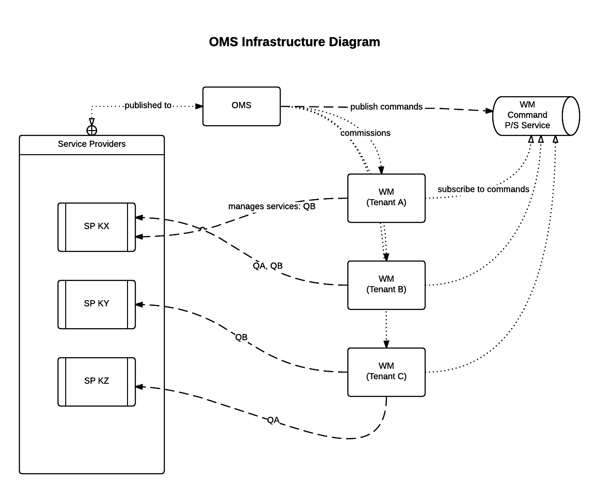

#Operations Management System

Orchestration of service providers, and Work Managers (WM) for tenants.

OMS is responsible for the orchestration of services on behalf of tenants. Each tenant as a Work Manager that interacts directly with Service Providers to control tasks for its configured tenant.

###Work Managers
A work manager (WM) manages job execution though Service Providers, using operational settings defined by the OMS. Each tenant has its WM instance.

WMs receive messages from the OMS through a publish-subscribe service; these messages are mostly requests about current operational status, and heath checks, but may include shutdown requests.

###Service Providers
Service providers (SP) are independent systems, that optionally implement a defined set of services that can be requested from WMs. Each SP publishes information about the services it can provision to WMs,  and API for job execution control (submit, status check, stop). Despite being independent, each SP has to be registered in the OMS, with information about its provisioned services. The OMS orchestrates WM configuration based on availability of SPs, and the desired configuration scenarios.

##Services
The goal of the OMS is to manage the configuration of services to be provisioned for each tenant. A service is specific operational task that may require input, and/or generates output. Examples of services are data harvesting (importing data into a data store), computing recommendations, run optimisation trials, i.e. A/B testing; SPs are geared at executing these tasks, as directed by WMs, which are configured through the OMS. 

###On: Tenant Service Provisioning
A single WM instance manages service provisioning for a tenant though SPs. Some services can make use of multiple service providers simultaneously. For example, two different optimisation SPs may be used simultaneously for different computational approaches under that under evaluation. It is up to the WM to implement the logic for combining and/merging results from multiple SPs, according on the type of service being provisioned.

###On: Work Manager Monitoring & Control
Besides bootstrapping instances of WMs, OMS also monitors the services running under a WM. This is done through the periodic heartbeats sent to the WM, requesting details on status of running operations. 
When a WM needs to replaced, e.g. major configuration change, it must try to gracefully shutdown all running operations across all SPs where jobs are actively running under its purview. The running WM must completely shutdown, before a new one is spawned to replace it.

###On: Work Manager Configuration
Different providers can offer a same service for WMs on the system. Thus, each service provider must comply to a standard API for service configuration, e.g. frequency of operation, timeout, data source, output source; similarly, all WMs need a standardised configuration and mechanism for communicating with SPs, e.g. host address, heartbeat broadcast, interface for service discovery, etc.

###On: Service Providers Common Interfaces
To enhance future expansion of services provisioned by the platform, all SPs should implement a common interface for service discovery, execution and control. Since SPs can be operate with different data stores, and third party applications, it is only fitting that we define that interface here.

  - Service Discovery
	  - List of services provisioned by the SP
		  - REST endpoint: `/services`
  - Job/Task Execution
	  - Statistics and list of jobs running on the SP
		  - REST endpoint: `/jobs/`
	  - Details and control of a job instance running on the SP
		  - REST endpoint :`/jobs/:id`
  - System Health
	  - Status of system (e.g. uptime, jobs executed on the day, number of queued jobs)
		  - REST endpoint: `/status`

**TODO**: define data scheme for each endpoint operation
