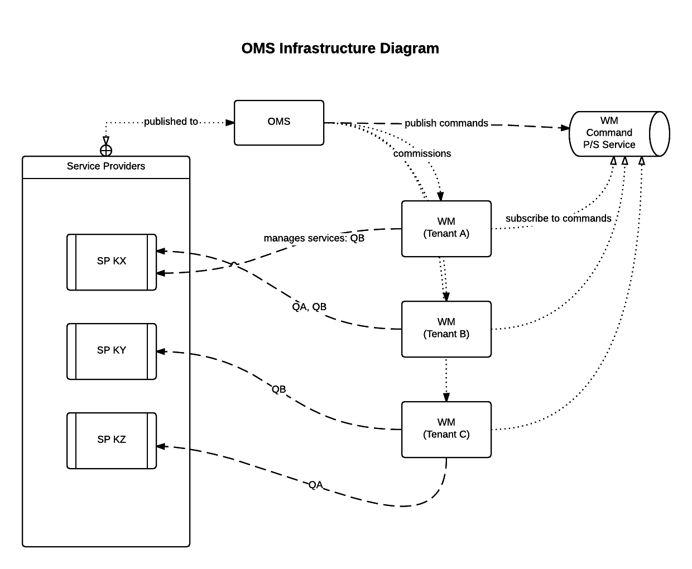

= Oasis Documentation
:linkcss:
:experimental:
:numbered:
:icons: font
:source-highlighter: coderay
:toc: left
:docinfo1:

== Getting Started

OMS is orchestration tool for service providers. Service providers (SP) are independent systems, that optionally implement 
a defined set of REST services that can be requested from OMS. Despite being independent, each SP has to be registered 
in the OMS.

The goal of the OMS is to manage the configuration of services to be provisioned for each tenant. A service is specific 
operational task that may require input, and/or generates output. Examples of services are data harvesting (importing 
data into a data store), computing recommendations, run optimisation trials, i.e. A/B testing; SPs are geared at 
executing these tasks which are configured through the OMS. 

== Communication

Basic communication for task execution is:

image::basic-comm-task.png[Communication for executing task]

When timeout occured, OMS will perform the following actions:

image::timeout-handling.png[Timeout handling]

When service provider start running the job, it is expected to send message to OMS that looks like:
 
[source,json]
----
{
  "serviceProvider": "SP1",       // <1>
  "jobId": "123",                 // <2>
  "event": "START",               // <3>
  "time": "2015-12-01T09:30:00"   // <4>
}
----
<1> The name of service provider that is responding. 
<2> This is the associated job id. 
<3> Event should be `"START"`.
<4> The time when this event occured.

When service provider finished executing the job, it is expected to send message to OMS that looks like:

[source,json]
----
{
  "serviceProvider": "SP1",         // <1>
  "jobId": "123",                   // <2>
  "event": "SUCCESS",               // <3>
  "time": "2015-12-01T10:00:00"     // <4>
}
----
<1> The name of service provider that is responding.
<2> This is the associated job id.
<3> Event should be `"SUCCESS"`.
<4> The time when this event occured.

As an additional information, service provider can also provide information about execution time by sending
message that looks like:

[source,json]
----
{
  "serviceProvider": "SP1",              // <1>
  "jobId": "123",                        // <2>
  "processing_time": "60500"             // <3>
}
----
<1> The name of service provider.
<2> The id of job.
<3> Time spends for executing this task in seconds.

If service provider failed to execute the job, it is expected to send message to OMS that looks like:

[source,json]
----
{
  "serviceProvider": "SP1",               // <1>
  "jobId": "123",                         // <2>
  "event": "FAILURE",                     // <3>
  "reason": "Can't connect to database",  // <4>
  "time": "2015-12-01T09:40:00"           // <5>
}
----
<1> The name of service provider that is responding.
<2> This is the associated job id.
<3> Event should be `"FAILURE"`.
<4> The reason for this failure (usually an `Exception`).
<5> The time when this event occured.

Service provider is expected to periodically send heartbeat message that looks like:

[source,json]
----
{
  "serviceProvider": "SP1",       // <1>
  "event": "HEARTBEAT",           // <2>
  "time": "2015-01-10T10:12:11"   // <3>
}
----
<1> The name of service provider that is sending heartbeat.
<2> Event should be `"HEARTBEAT"`.
<3> The time when this heartbeat was sent.

OMS uses ActiveMQ to communicate with another components.  It uses the following queues:

1. Every service provider has their own queue to receive commands from OMS.  The queue must be in 
the following name `{SPNAME}.COMMAND`.  For example, OMS will send command to service provider SP1 by
using queue `SP1.COMMAND`.
2. OMS listens on `OMS.STATUS` queue for receiving answers from service providers.
3. OMS listens on `OMS.HEARTBEAT` queue for receving heartbeat from service providers.

== Service Provider

Service provider accepts command message such as:

[source,json]
----
{
   "type": "trim-data",                        // <1>
   "payload": {                                // <2>
      "tenant": "tenant1",
      "date": "2015-12-31",
      "startingDate": "2015-12-30",
      "period": 30
   }
}
----
<1> This is the service to perform for this command.
<2> This is the payload (parameters) for that service.

The `correlation-id` header contains specific identifier for this command.  When using STOMP to reply this
command, you can include the value of existing `correlation-id` as header in SENT command.

The supported types of service are:

1. `"trim-data"` 
2. `"compute-recommendation"`
3. `"import-record"`
4. `"sync-item-store"`

Every services comes with their own payload.  See the documentation for each service for more information.

=== Data Source

Data source determines the input or the output of a task.  For example, an AWS S3 data source configuration
 looks like:
 
[source,json]
----
{
   "type": "s3",
   "bucket": "exercises",                         // <1>
   "prefix": "photos/2006/January/sample.jpg",    // <2>
   "region": "eu-west-1"                          // <3>
}
----
<1> This is the bucket name.
<2> This is the prefix for the requested value.
<3> This is the server's region.

Another type of data source is HTTP data source, for example:

[source,json]
----
{
   "type": "http",             // <1>
   "host": "www.xxx.com",      // <2>
   "port": 8080,               // <3>
   "path": "/January/data"     // <4>
}
---- 
<1> The type of data source, can be `"s3"`, `"http"`, `"https"`, or `"tapirus"`.
<2> This is the host name.
<3> This is the port number.
<4> This is the absolute path to the resource.

A special case of HTTP data source is a Tapirus data source which specify the location of Tapirus, for example:

[source,json]
----
{
   "host": "192.168.0.100",    // <1>
   "port": 1999                // <2>
   "type": "tapirus"           // <3>
}
----
<1> This is the location of Tapirus service.
<2> This is the port number of Tapirus service.
<3> To indicate this is communication with Tapirus, the value should be `"tapirus"`.

=== Authentication

When authentication is required, it can be specified by using Json such as:

[source,json]
----
{
   "username": "root", 
   "password": "toor"   
}
----

=== Services

==== Trim Data

Trim data service (`trim-data`) will remove old data from service provider's data source.  The payload requires for this service 
is something like:

[source,json]
----
{
   "tenant": "the_tenant_id",
   "date": "2015-12-01",
   "startingDate": "2015-11-01",            // <1>
   "period": 30                             // <2>
}
----
<1> The starting point of trimming (for the data).
<2> Number of days to trim up to `startingDate`.

==== Compute Recommendation

Computer recommendation service (`compute-recommendation`) is used the generate offline recommendation.  This service
accepts payload such as: 

[source,json]
----
{
   "tenant": "the_tenant_id",
   "date": "2015-12-01", 
   "hour": 12
   "algorithm": {                                    // <1>
     "name": "algo-1",                               // <2>
     "params": {                                     // <3>
        "param1": "value1",
        "param2": "value2"
     }
   },
   "output": {                                       // <4>
      "type": "s3",
      "bucket": "exercises",                         
      "prefix": "photos/2006/January/sample.jpg",    
      "region": "eu-west-1"
   }
}
---- 
<1> This is the algorithm to use.
<2> The name of the algorithm to use.  The value can be vary depends on the service provider.
<3> The parameter for the algorithm (if any).
<4> The target data source to store the result of offline processing.

==== Import Record

Import record service (`import-record`) is used to import data from Tapirus into data source used by service provider.  
The input for this service must be a Tapirus data source.

The payload required for this service is something like:  

[source,json]
----
{
   "tenant": "the_tenant_id",
   "date": "2015-12-01",
   "hour": 10,                       // <1>
   "input": {                        // <2>
      "type": "tapirus",
      "host": "192.168.0.100",
      "port": 1999      
   }
}
----
<1> This is the hour to read from Tapirus.
<2> This is the location of Tapirus data source.

==== Sync Item Store

Sync item store service (`sync-item-store`) is used to push the calculated recommendation (offline) into another data source
 such as S3 server.
 
The payload required for this service is something like: 

[source,json]
----
{
   "tenant": "the_tenant_id",
   "target": {                                      // <1>
      "type": "s3",
      "bucket": "exercises",
      "prefix": "photos/2006/January/sample.jpg",
      "region": "eu-west-1"
   } 
}
----
<1> This is the target data source.

== Configuration

Every single application can be scheduled and has its own configuration.  TO create new app, open *Application* menu
and click on *Add*.  Add detail for the application such as name, tenant, service provider, and its own cron schedule.

To configure an app, click on the name of the app and click on *Task Detail*.  A single application can have multiple
tasks that will be executed in sequentially when it is running.  Every single tasks is configured by using Json payload
that looks like:

[source,json]
----
{
   "type": "compute-recommendation",
   "timeout": 700000,                             // <1>
   "payload": {
      "date": "${CURRENT_DATE}",                  // <2>
      "algorithm": {
         "name": "duo"
      },
      "output": {
        "type": "s3",
        "bucket": "exercises",
        "prefix": "test",
        "region": "eu-west-1"
      }
   }
}
----
<1> This is a timeout period in seconds.  If no reply is received from service provider after exceeded this timeout
periods, this task will be skipped and the next task of this app will be executed (if any).
<2> Expression such as `${CURRENT_DATE}` will be evaluated on task execution.

TIP: OMS will add `tenant` automatically to the payload so it is not necessary to be defined in the configuration.

You embed JavaScript expression inside a string value by using `${...}`.  The following is list of available global variables:

1. `CURRENT_DATE`:  The date when this expression is evaluated such as `"2015-10-11"`.
2. `CURRENT_HOUR`:  The hour when this expression is evaluated such as `"23"`.

== Alternative Design

As an alternative approach, the collection of services executed for a tenant can be grouped into an entity called *app* 
(application).  One tenant can have more than one *app*.  The benefits of this design are:

1. If one *app* is down, it will not affect another *app*.
2. Existing *app* can be modified (customized for specific tenant) without affecting another *app*s which are running.

One approach to achieve this is by using PredictionIO.  The concept of *app* will be mapped directly into PredictionIO 
application.

Another services in the future:

. Recommendation stack:
.. Trim-data / Session SP
.. Import record
.. Process recommendation
. A/B Stack
.. Process results from fisher
.. Generate score
. Opt Stack
.. Takes values from A/B
.. Change config
.. Update dashboard config and generate javascript.
